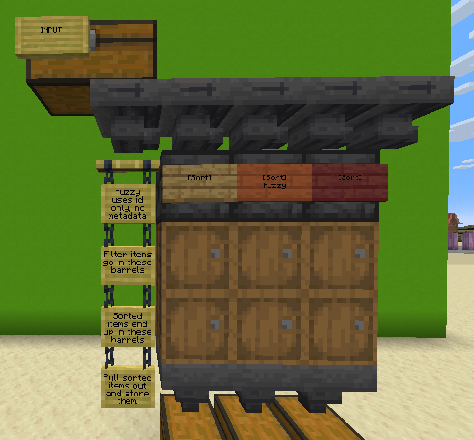

# BeardSort

## How to use

1. Place a chiseled deepslate, beneath a hopper line.
2. Beneath that, place two barrels (other invs might work, but barrels have most slots and remain accessible)
3. Place a sign on the deepslate as shown (any normal sign works)
4. On the second line, write `[Sort]` **Note the capitalized first letter**
5. On the fifth line, you may write fuzzy. This switches from exact match to fuzzy.
    - **Exact match**: id, durability, enchantments etc are all checked.
    - **Fuzzy match**: only id is checked (e.g. a near broken unenchanted diamond sword in the filter barrel will match a mending sharpness V fully repaired diamond sword with the custom name "stabby")
6. The top barrel is the filter, any items in here are used for matching as per the setup on the sign described above.
7. The lower barrel is where items are placed if successfully matched.
